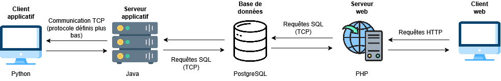

# 🏭 Absolut Warehouse

**Absolut Warehouse** est une application client-serveur destinée à la **gestion d’entrepôt**.  
Le système repose sur une architecture distribuée où plusieurs composants communiquent via différents protocoles (TCP, HTTP, SQL).

---

## 🧩 Architecture du système

L’architecture d’**Absolut Warehouse** est composée de plusieurs couches interconnectées :

### 1. Client applicatif
- **Technologie :** Python  
- **Rôle :** Interface principale utilisée par les opérateurs d’entrepôt.  
- **Communication :** Envoie des requêtes via **TCP** au serveur applicatif selon un protocole défini.

### 2. Serveur applicatif
- **Technologie :** Java  
- **Rôle :** Cœur logique du système.  
  - Traite les requêtes reçues du client Python.  
  - Gère les transactions avec la base de données.  
  - Assure la cohérence des données.  
- **Communication :**
  - Avec le client Python : **TCP**
  - Avec la base de données PostgreSQL : **SQL (TCP)**

### 3. Base de données
- **Technologie :** PostgreSQL  
- **Rôle :** Stockage centralisé des données liées à la gestion des stocks, produits, commandes, etc.

### 4. Serveur web
- **Technologie :** PHP  
- **Rôle :** Fournit une interface web pour la consultation ou l’administration du système.  
- **Communication :**
  - Avec la base de données : **SQL (TCP)**
  - Avec les clients web : **HTTP**
  - 
---

## ⚙️ Technologies principales

| Composant             | Technologie | Protocole principal |
|-----------------------|--------------|----------------------|
| Client applicatif     | Python       | TCP                  |
| Serveur applicatif    | Java         | TCP / SQL            |
| Base de données       | PostgreSQL   | SQL (TCP)            |
| Serveur web           | PHP          | HTTP / SQL           |

---

## 📊 Schéma d’architecture

---

## 🚀 Installation

Pas encore détaillés

## 📦 Fonctionnalités principales

- Gestion des produits et des stocks  
- Suivi des entrées et sorties d’inventaire  
- Interface Python pour les opérateurs  
- Interface web pour les administrateurs  
- Communication client-serveur fiable via TCP  
- Base de données PostgreSQL sécurisée  

---

## 🧑‍💻 Auteurs

- **Nom des développeurs :** Thomas Hornung, Haohan Yu et Gauthier Defrance
- **Projet universitaire :** à CY Université
